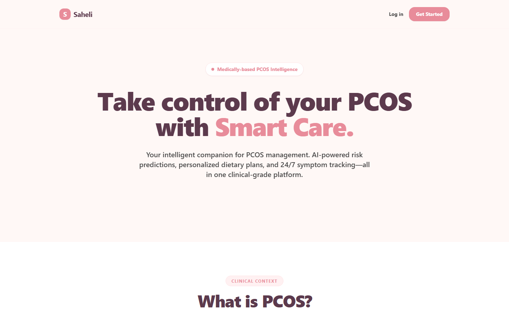
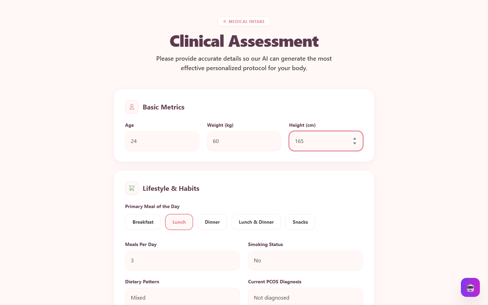
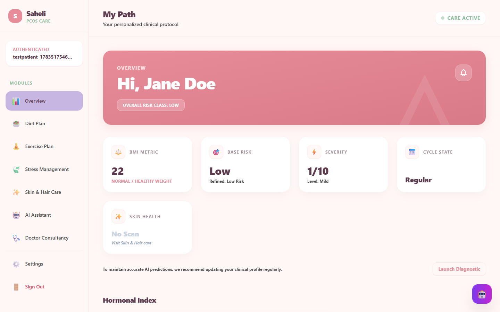
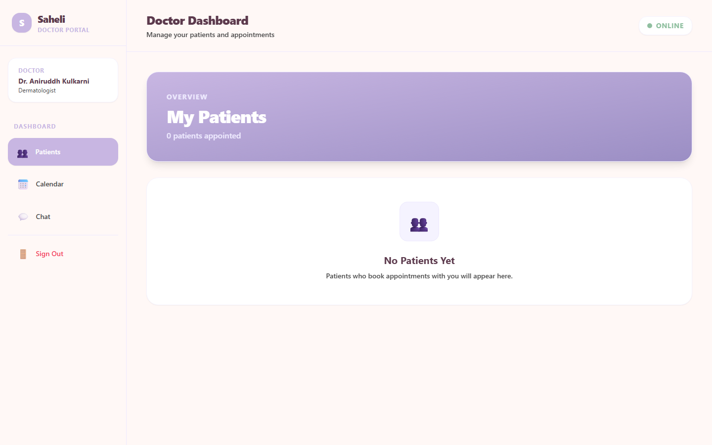
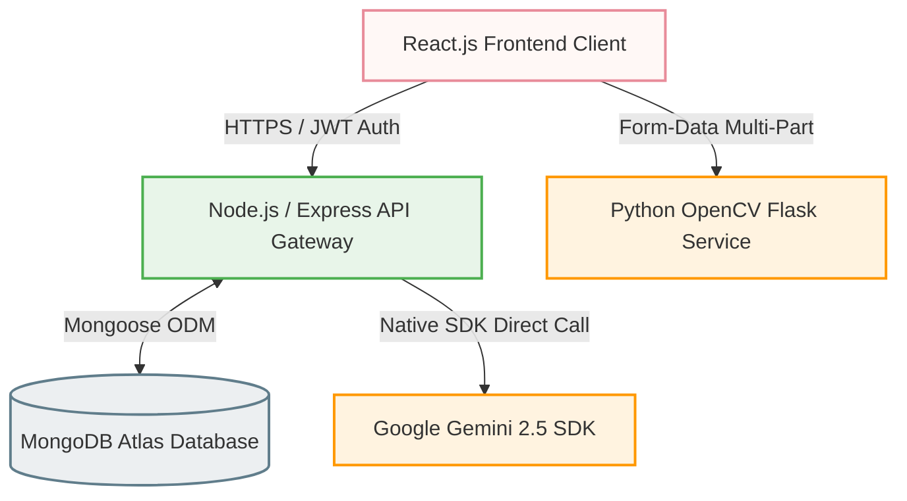

# 🌸 Saheli – Smart PCOS Care Platform

<div align="center">

**An AI-powered, full-stack clinical guidance and diagnostic platform designed to help women manage and understand PCOS through Gemini AI, OpenCV skin analysis, and medical consultation portals.**

[](https://nodejs.org)
[](https://react.dev)
[](https://www.mongodb.com/atlas)
[](https://deepmind.google/technologies/gemini/)
[](https://opencv.org/)

[🖥️ Explore Features](#-key-features) • [📐 System Architecture](#-system-architecture--engineering-highlights) • [🔌 API Docs](#-api-endpoints-reference) • [🚀 Setup Guide](#-getting-started--installation)

</div>

---

## 📖 Product Overview

Saheli addresses a critical gap in women's health: accessible, automated, and comprehensive guidance for Polycystic Ovary Syndrome (PCOS). The platform integrates clinical intake forms, multi-role user dashboards, real-time AI report generation, and computer-vision skin diagnostics into a unified web application.

---

## 📸 Product Experience (UI Showcase)

### 🌐 Welcome & Role Selection
An elegant portal path designed with smooth animations and curated pastel color tones.


---

### 📋 Clinical Assessment Intake
A structured medical intake form that processes physiological metrics, symptoms, and intensity scores.


---

### 👩 Patient Care Dashboard
Provides dynamic, personalized diet, workout, and skincare protocols generated from the AI health report.


---

### 👨‍⚕️ Doctor Consultation Portal
Verified doctors can review patient medical records, check status updates, and track symptom trends over time.


---

## 🎥 Interactive Demos

Experience the platform workflows through the high-resolution demo captures below:

<table>
  <tr>
    <td align="center"><b>👩 Patient Portal & Care Journey</b></td>
    <td align="center"><b>📋 Clinical Intake & AI Synthesis</b></td>
    <td align="center"><b>👨‍⚕️ Doctor Review Dashboard</b></td>
  </tr>
  <tr>
    <td><a href="./Pre-view-imgs/patient-demo.mp4">▶️ Play Patient Demo</a></td>
    <td><a href="./Pre-view-imgs/Assesment-demo.mp4">▶️ Play Assessment Demo</a></td>
    <td><a href="./Pre-view-imgs/doctor-demo.mp4">▶️ Play Doctor Demo</a></td>
  </tr>
</table>

---

## 📐 System Architecture & Engineering Highlights

Saheli's services are split into a decoupled, distributed microservices network to ensure high availability, security, and computational efficiency.



### 🧠 Core Engineering Achievements:
*   **Resilient AI Pipeline:** Built a robust API ingestion layer around **Google Gemini 2.5 Flash** with custom retry rules, JSON extraction fail-safes, and data validation handlers to prevent system failures from API rate limits.
*   **Computer Vision Diagnostics:** Configured a dedicated Python OpenCV microservice. It decodes image files directly to NumPy arrays, detects facial structures using Haar Cascades, performs **HSV color-space segmentation** for red-blemish masks, and classifies severity scores programmatically.
*   **Granular Authentication & Route Guards:** Designed role-based route verification (Patient, Doctor, Admin) by utilizing structured JWT header payloads and Express.js middleware handlers.
*   **Modular Care Architecture:** Programmed dynamic schema bindings in MongoDB, allowing clinical outputs to generate custom diet, exercise, and lifestyle tracks on the client UI instantly.

---

## 🛠️ Production Tech Stack

### Frontend Client
*   **Core:** React 19, Vite (for optimized bundler performance)
*   **Routing:** React Router 7 (client-side state protection)
*   **Aesthetics:** Tailwind CSS (custom keyframe animations, glassmorphism UI overlays)
*   **Client Communication:** Axios with centralized interceptors

### Backend & API Gateway
*   **Runtime:** Node.js (v18+) & Express.js
*   **Database:** MongoDB Atlas with Mongoose ODM (indexing, validation schemas)
*   **Auth Engine:** JWT (JSON Web Tokens) & BcryptJS (salted hashing)
*   **Media Ingestion:** Multer (strict size limitations and file extension filters)

### Python Microservice
*   **Runtime:** Python 3.11 with Flask API
*   **CV Engine:** OpenCV (cv2) & NumPy

---

## 🔌 API Endpoints Reference

### User & Practitioner Access
```http
POST /api/auth/register      --> Register a new patient account
POST /api/auth/login         --> Authenticate patient (returns JWT)
POST /api/doctor/login       --> Authenticate verified doctor (returns JWT)
POST /api/admin/login        --> Authenticate admin (returns JWT)
```

### Assessment & AI Diagnostics
```http
POST /api/assessment/submit  --> Submit clinical questionnaire (triggers Gemini AI pipeline)
GET  /api/assessment/latest  --> Retrieve user's latest clinical form answers
GET  /api/ai-report/latest   --> Retrieve user's latest generated Gemini PCOS report
```

### Computer Vision Service
```http
POST http://localhost:8000/analyze-skin --> Ingest image for blemish/acne severity segmentation
```

---

## 🚀 Getting Started & Installation

### 1. Pre-requisites
*   Node.js (v18.0.0 or higher)
*   Python (v3.8 or higher)
*   A running MongoDB server (local instance or MongoDB Atlas URI)
*   A Gemini API Key (obtained from [Google AI Studio](https://aistudio.google.com/))

### 2. Backend Installation
1.  Navigate to the backend:
    ```bash
    cd backend
    ```
2.  Install packages:
    ```bash
    npm install
    ```
3.  Create a `.env` file in `/backend`:
    ```env
    PORT=5000
    MONGODB_URI=mongodb://127.0.0.1:27017/Saheli
    JWT_SECRET=your_jwt_secret_key
    GEMINI_API_KEY=your_google_gemini_api_key
    ```
4.  *(Optional)* Populate doctor and admin test profiles:
    ```bash
    node seedDoctors.js
    node seedAdmins.js
    ```
5.  Launch development environment:
    ```bash
    npm run dev
    ```

### 3. Frontend Client Installation
1.  Navigate to the frontend:
    ```bash
    cd ../frontend
    ```
2.  Install dependencies:
    ```bash
    npm install
    ```
3.  Launch Vite server:
    ```bash
    npm run dev
    ```
    Access the application at **http://localhost:5173**.

### 4. OpenCV Diagnostic Microservice
1.  Navigate to the service directory:
    ```bash
    cd ../opencv_service
    ```
2.  Set up and activate a virtual environment:
    ```bash
    python -m venv venv
    # Windows:
    .\venv\Scripts\activate
    # macOS/Linux:
    source venv/bin/activate
    ```
3.  Install dependencies and launch:
    ```bash
    pip install -r requirements.txt
    python app.py
    ```
    *(Alternatively, on Windows, you can double-click `run_opencv.bat` from the root directory).*

---

## 🔮 Roadmap & Production Architecture Goals

- [ ] **Data Encryption at Rest:** Implement Field-Level Encryption (FLE) using MongoDB Client-Side Field Level Encryption (CSFLE) for protected health information.
- [ ] **WebRTC Virtual Rooms:** Add native video calling and live messaging between patients and consultants.
- [ ] **Machine Learning Offline Mode:** Supplement Gemini Cloud diagnostics with a lightweight local TensorFlow.js classifier for edge processing.
- [ ] **Apple HealthKit / Google Fit Synchronization:** Enable OAuth integrations to sync daily steps, sleep, and heart-rate fluctuations.

---

## 📄 Disclaimer & License

⚠️ **Clinical Disclaimer:** This application is developed for educational, demonstration, and research purposes. It is **not** intended to serve as a substitute for professional medical diagnosis, advice, or treatment. Always seek the advice of a qualified healthcare provider.

Distributed under the **Educational License**. See `LICENSE` for details.

---

<div align="center">
  Developed with 🌸 for women's health by <strong>Devam Patel</strong>
</div>
